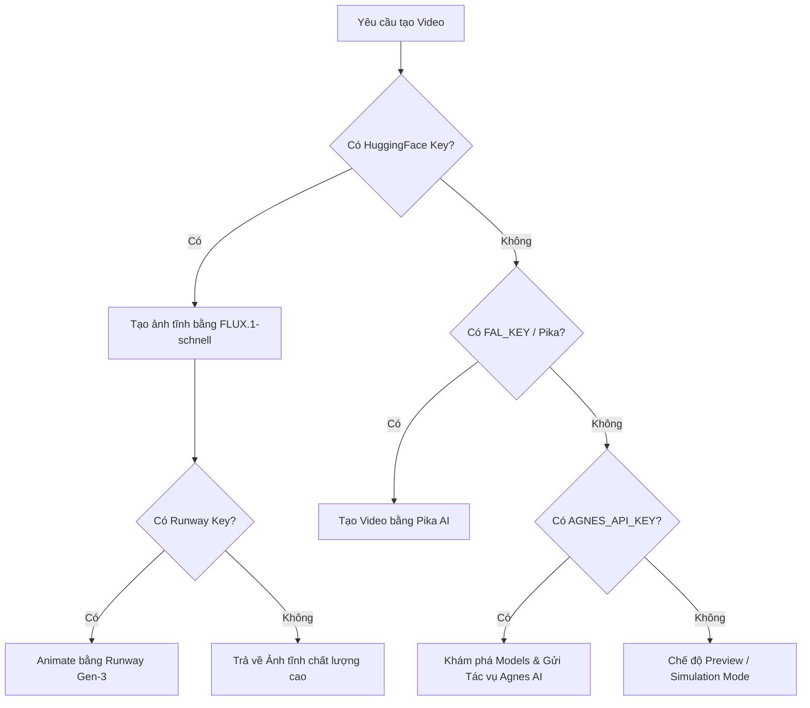
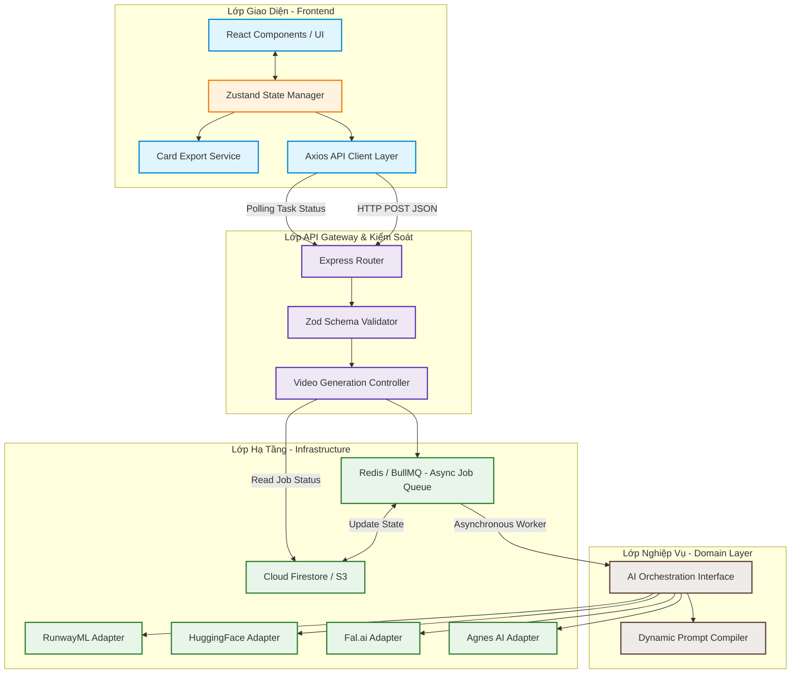

# BÁO CÁO PHÂN TÍCH KIẾN TRÚC HỆ THỐNG (ARCHITECTURE REPORT)
**Dự án:** Trình Tạo Thiệp & Video Chúc Mừng Lãng Mạn (Romantic Card & Video Generator)  
**Tác giả:** Chief Software Architect (25 Years of Enterprise Systems Experience)  
**Ngày lập báo cáo:** 21/07/2026  
**Tiêu chuẩn đánh giá:** Clean Architecture, SOLID, Domain-Driven Design (DDD), High-Performance enterprise standards.

---

## TOÀN CẢNH HỆ THỐNG & ĐẶT VẤN ĐỀ

Hệ thống hiện tại là một ứng dụng Full-stack kết hợp giữa **React (Vite) ở Frontend** và **Express (Node.js) ở Backend**, tích hợp sâu với các mô hình Generative AI (RunwayML, Hugging Face FLUX, Fal.ai/Pika, Agnes AI) để tạo ra các video thiệp chúc mừng lãng mạn động hóa từ các tùy chỉnh của người dùng.

Dù ứng dụng hoạt động mượt mà ở góc độ tính năng (đã giải quyết thành công các lỗi biên dịch màu sắc `oklab/oklch` và lỗi dính dấu cách của tiếng Việt khi xuất ảnh canvas), việc đánh giá hệ thống dưới lăng kính **Enterprise-Grade Architecture** cho thấy nhiều điểm nghẽn kiến trúc cốt lõi cần được tái cơ cấu để đảm bảo khả năng bảo trì, mở rộng và khả năng phục hồi (resilience).

---

## 1. PHÂN TÍCH CẤU TRÚC THƯ MỤC HIỆN TẠI (PROJECT STRUCTURE)

Cấu trúc hiện tại cực kỳ tinh giản, phù hợp cho các ứng dụng MVP (Minimum Viable Product):
```text
/ (Root)
├── .env.example
├── README.md
├── package.json
├── server.ts                 <-- Toàn bộ logic Backend, API Routing, AI Integration & Polling
├── tsconfig.json
├── vite.config.ts
├── src/                      <-- Toàn bộ logic Frontend
│   ├── App.tsx               <-- Monolithic Component (Chứa trạng thái, giao diện chỉnh sửa, canvas export, và audio)
│   ├── main.tsx
│   ├── index.css
│   └── assets/               <-- Tài nguyên hình ảnh tĩnh của thiệp
```

### Đánh giá Sơ bộ:
- **Ưu điểm:** Tốc độ khởi động phát triển nhanh, không có độ trễ phân mảnh file.
- **Nhược điểm:** Vi phạm nghiêm trọng nguyên lý **Separation of Concerns (SoC)**. Cả `server.ts` và `src/App.tsx` đều là các **God Files (Monoliths)** chứa hàng nghìn dòng code bao gồm từ giao diện, xử lý nghiệp vụ, quản lý tài nguyên, đến tích hợp hạ tầng bên ngoài.

---

## 2. PHÂN TÍCH CHI TIẾT FRONTEND (REACT / VITE)

Frontend được triển khai trong `/src/App.tsx`. 

### Đặc điểm Kỹ thuật:
- **Rendering Engine:** Sử dụng React 19 kết hợp Tailwind CSS để vẽ giao diện tùy biến (Scene, Background, Decors, Music).
- **Export Engine:** Sử dụng thư viện `html2canvas` để chụp lại vùng DOM `#generated-card-container` phục vụ cho việc tải ảnh chất lượng cao cục bộ.
- **Audio Control:** Phát nhạc nền thời gian thực dựa trên thẻ `<audio>` HTML5 đồng bộ với trạng thái giao diện.

### Điểm Yếu Kiến Trúc (Architectural Vulnerabilities):
1. **Quản lý State Tập trung quá tải (State Bloat):** `App.tsx` quản lý từ dữ liệu đầu vào của người dùng, danh sách sticker đã kéo thả, trạng thái phát nhạc, tiến độ tạo video, kết quả trả về từ API AI, cho đến trạng thái của modal xuất ảnh. Điều này gây ra việc **re-render không kiểm soát** (Performance Bottleneck) và rất khó viết Unit Test độc lập.
2. **Hỗn hợp Logic UI và Logic Hạ tầng (Infrastructure Coupling):** Logic xuất ảnh `html2canvas` với các hàm bổ trợ phức tạp như phân tích cú pháp màu sắc `oklabToRgb` và giải thuật chia tách chữ tiếng Việt `renderSpannedText` nằm trực tiếp bên trong component giao diện.
3. **Thiếu Lớp API Client (HTTP Client Layer):** Các cuộc gọi `fetch()` tới backend `/api/generate-video` được viết trực tiếp bên trong các event handler của button, thiếu cơ chế retry, abort controller hoặc phân tách module gọi API.

---

## 3. PHÂN TÍCH CHI TIẾT BACKEND (EXPRESS / NODE.JS)

Backend nằm trọn vẹn trong `/server.ts` đóng vai trò là một API Gateway kiêm Orchestration Service điều phối các AI API.

### Các API Router chính:
- `POST /api/generate-video`: Tiếp nhận yêu cầu tạo video, quyết định hạ tầng AI sẽ gọi (Hugging Face + Runway, Fal.ai/Pika, hoặc Agnes AI) dựa trên các biến môi trường cấu hình, đồng thời điều phối quá trình polling trạng thái cho các API không đồng bộ.

### Điểm Yếu Kiến Trúc:
1. **Thiếu Middleware Validate Dữ liệu đầu vào (Input Validation):** Dữ liệu từ client (`req.body`) được trích xuất trực tiếp mà không qua bộ lọc định dạng hoặc kiểm tra bảo mật (ví dụ: Zod hay Joi), dễ dẫn đến lỗi runtime (500 Error) khi thiếu trường dữ liệu.
2. **Poller Blocked Event Loop:** Giải pháp polling tác vụ tạo video không đồng bộ được viết trực tiếp trong API request handler bằng vòng lặp `for (let i = 0; i < 15; i++)` kết hợp với `setTimeout`. Trong môi trường Node.js đơn luồng (Single-threaded), việc giữ kết nối HTTP mở lâu (~45 giây) cho mỗi request để chờ polling sẽ nhanh chóng vắt kiệt socket pool và làm sập server khi có tải cao (Concurrent Requests).
3. **Cache lưu trữ trong bộ nhớ tạm thời (In-memory Cache Bloat):** Các cache kiểm soát danh sách model hoặc API endpoint thành công được lưu vào các biến toàn cục (`let cachedModels`, `let cachedSuccessEndpoint`). Cơ chế này sẽ mất tác dụng ngay khi container bị restart hoặc scale-out sang nhiều instance (Serverless Cloud Run), gây mất đồng bộ dữ liệu giữa các luồng xử lý.

---

## 4. PHÂN TÍCH TÍCH HỢP DỊCH VỤ AI (AI SERVICES ANALYSIS)

Dự án sở hữu giải pháp **Multi-Provider AI Fallback Strategy** cực kỳ xuất sắc và linh hoạt:



### Phân tích Kỹ thuật:
- **Hạ tầng Hugging Face + Runway:** Luồng tạo tối ưu nhất. Sử dụng mô hình tạo ảnh tiên tiến nhất `black-forest-labs/FLUX.1-schnell` để tạo nền từ prompt thiết kế, sau đó dùng Runway `gen3a_turbo` (image-to-video) để động hóa.
- **Hạ tầng Fal.ai (Pika):** Phương án dự phòng 1 tạo video trực tiếp từ text prompt.
- **Hạ tầng Agnes AI:** Phương án dự phòng 2, tích hợp thuật toán tự động dò tìm mô hình (`discoverModels`), tự động lưu bộ nhớ cache endpoint thành công để giảm thiểu HTTP 429 (Rate Limit Exceeded).

---

## 5. PHÂN TÍCH DEPENDENCY (BẢNG THÀNH PHẦN)

| Thư viện | Mục đích sử dụng | Đánh giá mức độ cần thiết |
| :--- | :--- | :--- |
| `react`, `react-dom` (v19) | Thư viện nhân UI chính | Bắt buộc. |
| `express` (v4) | Server ứng dụng | Phù hợp, nhẹ, phổ biến. |
| `html2canvas` (v1.4) | Chụp ảnh DOM | Cần thiết cho tính năng xuất thiệp dạng ảnh tĩnh. |
| `motion` (v12) | Hiệu ứng chuyển động mượt mà | Rất tốt cho trải nghiệm người dùng lãng mạn. |
| `@google/genai` (v2.4) | Bộ SDK Gemini mới nhất của Google | Đã được cài đặt sẵn để sẵn sàng cho các tích hợp AI tạo văn bản. |
| `@huggingface/inference`, `@runwayml/sdk`, `@fal-ai/client` | SDK tích hợp trực tiếp hạ tầng AI | Cần thiết để giao tiếp chuẩn hóa với các nền tảng đám mây. |
| `esbuild`, `tsx` | Biên dịch server TypeScript siêu tốc | Giải pháp xuất sắc nhất hiện tại cho môi trường production. |

---

## 6. ĐÁNH GIÁ KIẾN TRÚC THEO TIÊU CHUẨN QUỐC TẾ

### A. Clean Architecture
- **Entities (Nghiệp vụ cốt lõi):** Hiện tại không có lớp Entity độc lập. Các quy định nghiệp vụ về "Thiệp lãng mạn", "Scene", "Decors" bị phân mảnh dưới dạng các interface TypeScript định nghĩa ngay trong UI component.
- **Use Cases (Ứng dụng cụ thể):** Logic tạo thiệp, tạo video, tải ảnh, chơi nhạc đều bị lồng ghép trực tiếp vào React View hoặc Express Route, vi phạm quy tắc luồng phụ thuộc một chiều (Dependency Rule).
- **Interface Adapters (Controller/Presenter):** Thiếu lớp Adapter. Controller của Backend thực hiện cả nhiệm vụ định tuyến (routing) lẫn kết nối trực tiếp đến SDK của bên thứ ba (Runway, Hugging Face).

### B. Nguyên lý SOLID
- **S - Single Responsibility Principle:** Vi phạm nghiêm trọng ở cả Frontend (`App.tsx` quản lý UI, Export Canvas, State Audio, Call API) và Backend (`server.ts` xử lý Routing, AI API Orchestration, Cache, Polling).
- **O - Open/Closed Principle:** Chưa đạt. Khi muốn bổ sung thêm một nhà cung cấp AI mới (ví dụ: OpenAI Sora hoặc Leonardo AI), lập trình viên buộc phải can thiệp trực tiếp và sửa đổi khối cấu trúc điều kiện rẽ nhánh khổng lồ trong hàm `/api/generate-video`.
- **L - Liskov Substitution Principle:** Đạt yêu cầu nhờ thiết kế lỏng lẻo bằng các kiểu dữ liệu generic và giao tiếp JSON thô.
- **I - Interface Segregation Principle:** Đạt ở mức trung bình do cấu trúc dữ liệu gửi lên backend là một cục payload duy nhất chứa mọi tham số cấu hình.
- **D - Dependency Inversion Principle:** Vi phạm. Cả backend đang phụ thuộc trực tiếp vào các SDK cụ thể của bên thứ ba (`@runwayml/sdk`, `@huggingface/inference`) thay vì phụ thuộc vào một lớp giao diện chung (Interface/Abstraction) của dịch vụ AI.

### C. Domain-Driven Design (DDD)
- **Bounded Contexts:** Dự án có 2 Bounded Contexts chưa được phân ranh giới rõ ràng:
  1. *Card Customization Context:* Quản lý việc kéo thả, thiết kế thiệp, viết thiệp, render màu sắc.
  2. *Video Generation Context:* Quản lý việc chuyển đổi dữ liệu thiết kế thành prompt, gửi tác vụ lên AI, và polling trạng thái.
- **Aggregate Root / Value Objects:** Các đối tượng `PlacedItem` (vật trang trí kéo thả), `Scene` (chủ đề), `Song` (bài hát) chỉ đang tồn tại dưới dạng cấu trúc dữ liệu thô (Anemic Domain Model) chứ không chứa hành vi tự thân.

---

## 7. LIỆT KÊ NỢ KỸ THUẬT (TECHNICAL DEBT)

1. **High-Risk Polling:** Việc thực hiện Polling bất đồng bộ ngay trong luồng Request-Response HTTP của Express có thể khiến server rơi vào trạng thái nghẽn cổ chai (DoS tự thân) khi có từ 50-100 người dùng nhấn nút tạo video cùng lúc.
2. **Hardcoded Strings & Prompts:** Các cấu trúc Prompt mô tả Scene đang được hardcode trực tiếp bằng tiếng Anh trong mã nguồn Backend (`server.ts`). Việc thay đổi prompt đòi hỏi phải build và deploy lại toàn bộ ứng dụng.
3. **No Database Persistence:** Giao diện thiệp của người dùng chỉ tồn tại trên State của trình duyệt. Nếu người dùng refresh trang, toàn bộ thiết kế thiệp sẽ biến mất. Thiếu cơ chế lưu trữ bền vững (Persistent Storage) để chia sẻ thiệp qua liên kết động (Dynamic Link).
4. **Synchronous html2canvas Rendering Dependency:** Xuất ảnh canvas phụ thuộc vào môi trường máy trạm của khách hàng (Client-side rendering). Nếu thiết bị của người dùng yếu hoặc sử dụng trình duyệt không tương thích hoàn toàn, chất lượng ảnh xuất ra sẽ không đồng đều hoặc bị vỡ layout.

---

## 8. ĐỀ XUẤT KIẾN TRÚC MỚI (TARGET BLUEPRINT - SƠ ĐỒ MERMAID)

Kiến trúc đề xuất dưới đây tuân thủ nghiêm ngặt **Clean Architecture** và tách biệt các dịch vụ theo hướng **Microservices/Serverless-ready Architecture**:

### Sơ đồ luồng xử lý và Kiến trúc mới đề xuất:



---

## 9. LỘ TRÌNH TÁI CẤU TRÚC CHI TIẾT (REFACTORING ROADMAP)

Để đưa hệ thống hiện tại đạt tiêu chuẩn Enterprise ổn định mà không gây gián đoạn dịch vụ, lộ trình tái cấu trúc được chia làm 3 giai đoạn:

### Giai đoạn 1: Chia nhỏ Codebase (Refactor God Files) - *Độ ưu tiên: Cao nhất*
1. **Frontend:**
   - Trích xuất toàn bộ giao diện điều khiển, danh sách sticker, danh sách scene trong `App.tsx` ra các component con độc lập trong thư mục `/src/components/` (Ví dụ: `EditorPanel.tsx`, `CardCanvas.tsx`, `MusicPlayer.tsx`).
   - Tạo `/src/services/api.ts` để gói gọn các cuộc gọi API, tách biệt hoàn toàn khỏi các file JSX/TSX.
2. **Backend:**
   - Tách `/server.ts` thành cấu trúc MVC-Clean:
     - `/server/routes/`: Quản lý định tuyến API.
     - `/server/controllers/`: Điều phối các use case.
     - `/server/services/ai/`: Nơi chứa các Adapter riêng biệt cho từng AI Provider (Runway, HuggingFace, Fal, Agnes).

### Giai đoạn 2: Nâng cao Trải nghiệm & Độ tin cậy (Resilience & Reliability) - *Độ ưu tiên: Trung bình*
1. **Chuyển đổi sang Kiến trúc Bất đồng bộ (Event-Driven):**
   - Loại bỏ cơ chế Polling đồng bộ giữ kết nối HTTP trong Express.
   - Khi nhận yêu cầu tạo video, backend ghi nhận thông tin vào Database (hoặc RAM Queue), cấp cho Client một `TaskID` và phản hồi ngay lập tức `202 Accepted`.
   - Client sẽ định kỳ gọi lên `/api/tasks/:id` để kiểm tra trạng thái cực kỳ nhẹ nhàng, giải phóng hoàn toàn Event Loop của Node.js.
2. **Sử dụng Zod Validation:**
   - Đảm bảo mọi payload gửi lên Backend đều được kiểm tra tính toàn vẹn ở tầng biên để chặn đứng các request lỗi trước khi chúng tiêu tốn tài nguyên xử lý hoặc chi phí gọi API bên ngoài.

### Giai đoạn 3: Mở rộng tính năng và Lưu trữ (Cloud Native Expansion) - *Độ ưu tiên: Tương lai*
1. **Tích hợp Cloud Database (ví dụ: Firebase Firestore):**
   - Lưu trữ các thiệp chúc mừng đã tạo dưới dạng các bản ghi JSON liên kết với một `CardID` duy nhất.
   - Cung cấp tính năng "Chia sẻ thiệp" thông qua đường dẫn động `/card/:id`. Khi truy cập đường dẫn này, người nhận sẽ thấy một giao diện lật thiệp trực tiếp trên Web kết hợp với nhạc nền chạy tự động cùng video động cực kỳ sống động, nâng tầm trải nghiệm của sản phẩm từ một công cụ đơn thuần thành một mạng xã hội kết nối lời chúc.
2. **Tập trung hóa Prompt Metadata:**
   - Đưa các prompt và thiết lập phong cảnh (Scenes) vào cơ sở dữ liệu để có thể quản lý, tối ưu hóa prompt theo mùa (Valentine, Giáng sinh, Tết) mà không cần deploy lại code.

---

### KẾT LUẬN CỦA ARCHITECT
Dự án **Romantic Card & Video Generator** là một sản phẩm có tính sáng tạo và ứng dụng thực tiễn rất cao, việc kết hợp linh hoạt nhiều nhà cung cấp AI chứng minh tư duy thiết kế hệ thống có tính dự phòng tốt của đội ngũ phát triển. Việc nâng cấp mã nguồn theo cấu trúc **Clean Architecture** và áp dụng lộ trình tái cấu trúc trên sẽ biến ứng dụng hiện tại từ một công cụ MVP trở thành một nền tảng vững chắc, sẵn sàng đón nhận hàng triệu người dùng cùng lúc với chi phí vận hành tối ưu nhất.
