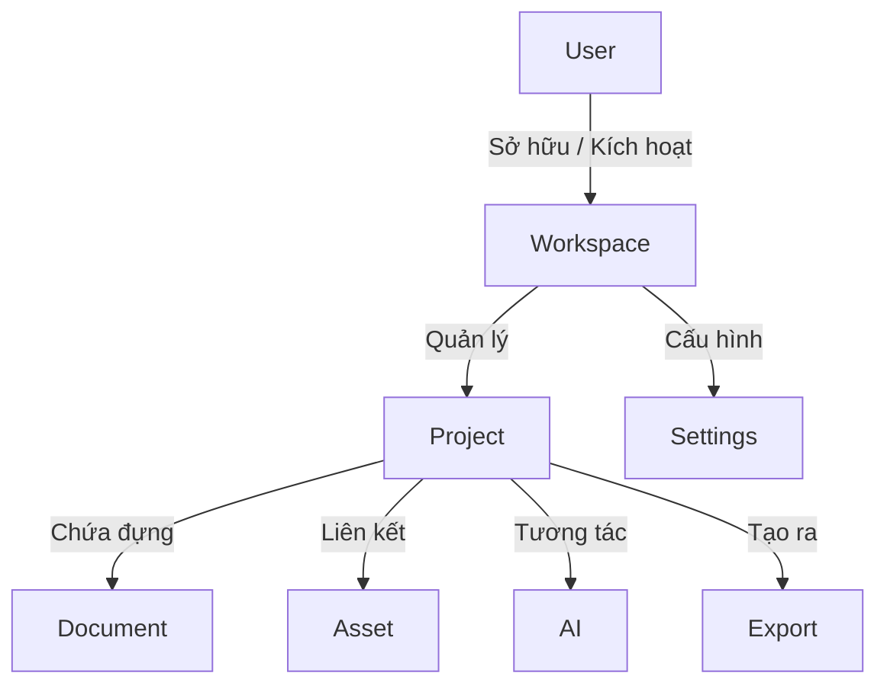
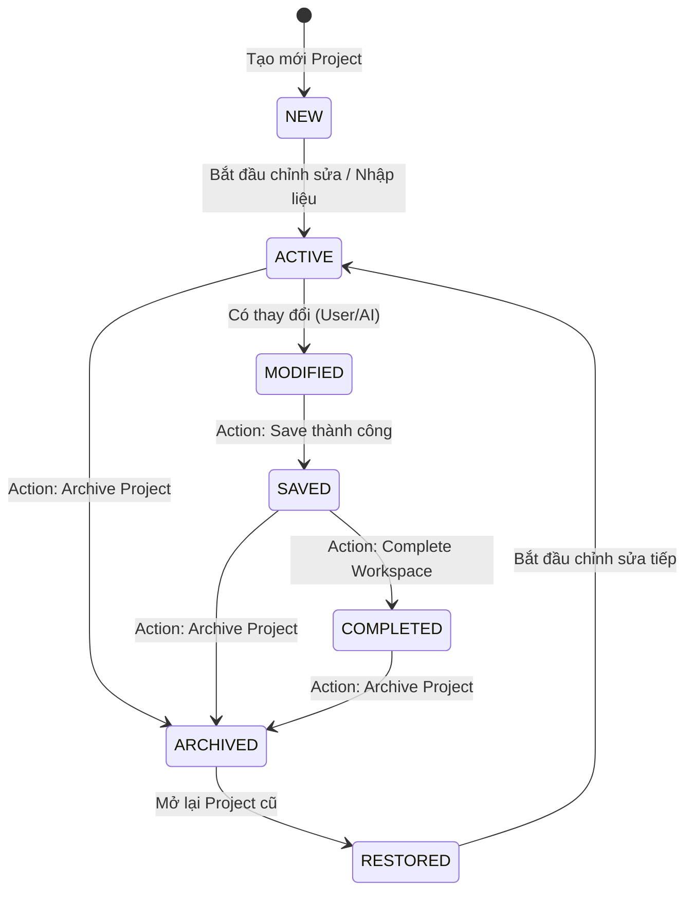

# LoveNote Operating System Specification (LNOS-SPEC v1.0)
> **Single Source of Truth (SSOT) - Bản Hiến pháp Kiến trúc, Trải nghiệm & Quy luật Vận hành LoveNote**
> *Tài liệu nền tảng cấp cao dành cho tất cả các phiên bản: Web, Windows, Android, iOS, macOS, Enterprise và Education.*
> *Được phê duyệt bởi Chief Product Architect & AI Studio Core Engineering Team*

---

## 📖 Tuyên ngôn Triết lý Vận hành (Operating Philosophy)

> **"LoveNote is not a collection of screens. LoveNote is a continuous workspace where screens are merely different views of the same working context."**
> 
> *LoveNote không phải là một tập hợp các màn hình hay module độc lập. LoveNote là một không gian làm việc liên tục, trong đó các màn hình chỉ là những góc nhìn (Views) khác nhau để tương tác với cùng một ngữ cảnh làm việc (Context) đang chạy ngầm.*

Tất cả các thành viên phát triển dự án, các thuật toán AI và các thành phần giao diện đều phải tuân thủ nghiêm ngặt nguyên lý tối cao này. Chúng ta không xây dựng phần mềm dựa trên các "màn hình chuyển đổi", chúng ta xây dựng một "Hệ điều hành trải nghiệm" nơi dữ liệu và ngữ cảnh luôn trôi chảy liên tục, an toàn và có thể dự đoán được.

---

# VOLUME A: CORE ARCHITECTURE
> **Kiến trúc Tầng lõi - Định hình Vũ trụ Đối tượng và Vòng đời Vận hành**

### A1. Core Philosophy (Triết lý cốt lõi)
Hệ điều hành LNOS bốc tách hoàn toàn phần hiển thị (UI) ra khỏi dữ liệu thực tế (Data). Người dùng không bao giờ "chuyển màn hình" làm mất dữ liệu. Thay vào đó, viewport chỉ đang dịch chuyển qua các tiêu điểm (focal points) khác nhau của cùng một Workspace. Mọi thao tác đều phải đảm bảo tính liên tục, không nạp lại trang (No Reload), không làm sạch bộ nhớ ngữ cảnh giữa chừng (No Context Flush).

### A2. Domain Model (Mô hình đối tượng gốc)
LoveNote chỉ tồn tại duy nhất **8 đối tượng gốc (Core Domain Objects)**. Cấm tuyệt đối việc tạo ra các thực thể lai căng ngoài danh mục này:

1. **User (Người dùng)**: Đối tượng trung tâm sở hữu quyền truy cập, danh tính và cấu hình tài khoản.
2. **Workspace (Không gian làm việc)**: Ngữ cảnh chuyên biệt hóa trải nghiệm (ví dụ: *Card Workspace*, *Journal Workspace*, *Timeline Workspace*, *Search Workspace*).
3. **Project (Dự án)**: Container chứa đựng toàn bộ tài nguyên, tài liệu, phiên hội thoại AI và lịch sử của một chủ đề cụ thể (ví dụ: *Dự án Kỷ niệm Đám cưới Phong & Quỳnh*).
4. **Document (Tài liệu)**: Bản thể sáng tạo vật lý, dữ liệu gốc do người dùng hoặc AI viết nên (ví dụ: *Wedding Card*, *Love Letter*, *Diary Entry*).
5. **Asset (Tài nguyên)**: File đa phương tiện, nhạc nền, stickers, template đính kèm vào Project.
6. **AI (Trợ lý AI)**: Động cơ thông minh hỗ trợ sinh nội dung, phân tích layout, gợi ý ý tưởng.
7. **Export (Xuất bản)**: Thành phẩm đầu ra vật lý (Ảnh PNG, File PDF, Web Link chia sẻ, lịch sử kết xuất).
8. **Settings (Cài đặt)**: Tùy chỉnh cấu hình cá nhân hóa hệ thống.

### A3. Relationship Model (Mô hình quan hệ)
Mối quan hệ giữa các thực thể gốc tuân thủ sơ đồ phân cấp chặt chẽ:



*   **Workspace không phải là màn hình**: Workspace là một môi trường chứa một hoặc nhiều Projects.
*   **Project là một Container thực sự**: Project không bao giờ bằng một Document duy nhất (ví dụ: Project không chỉ là "Tấm thiệp"). Project chứa Document, Assets, Timeline, AI Session và lịch sử Export.
*   **Document là dữ liệu thuần túy**: Nằm sâu trong Project và chịu sự kiểm soát của Workspace tương ứng.

### A4. Ownership Model (Mô hình sở hữu năng lực)
Bảng định nghĩa rõ ràng về đơn vị chịu trách nhiệm cho các hành động cốt lõi:

| Hành động / Tính năng | Thực thể sở hữu chính | Mô tả quyền hạn |
| :--- | :--- | :--- |
| **Save (Lưu trữ)** | `Workspace` | Chịu trách nhiệm đồng bộ trạng thái của toàn bộ Project xuống DB. |
| **Undo / Redo** | `Workspace Session` | Quản lý ngăn xếp (stack) lịch sử thay đổi của Document đang mở. |
| **History (Lịch sử)** | `Project` | Lưu trữ nhật ký hành động, các phiên bản cũ của Document. |
| **Recovery (Cứu hộ)** | `Global Navigation Service` | Quản lý Safety Checkpoint khi người dùng thoát hoặc hệ thống gặp sự cố. |
| **Navigation** | `Global Navigation Service` | Điều hướng giữa các Workspace, không cho phép View tự ý chuyển trang. |
| **State (Trạng thái)** | `Workspace State Machine` | Đảm bảo tính nhất quán của trạng thái vòng đời Workspace. |

### A5. Lifecycles (Vòng đời đối tượng)

#### 1. Workspace Lifecycle
Mọi Workspace đều phải đi qua chính xác 7 trạng thái vòng đời chuẩn hóa này:


#### 2. Document Lifecycle
*   `DRAFT` (Bản nháp): Dữ liệu đang được sửa đổi liên tục, chưa cam kết xuất bản.
*   `COMMITTED` (Đã lưu): Đã ghi nhận bản ổn định vào cơ sở dữ liệu.
*   `LOCKED` (Đã khóa): Sau khi đã Export thành phẩm, Document chuyển sang chế độ chỉ đọc để tránh vô tình chỉnh sửa phá vỡ kỷ niệm.

#### 3. AI Session Lifecycle
*   `CONNECTING` (Đang kết nối) ➔ `ACTIVE` (Sẵn sàng) ➔ `BUSY` (Đang tạo nội dung) ➔ `STANDBY` (Chờ phản hồi tiếp) ➔ `TERMINATED` (Kết thúc phiên).

#### 4. Export Lifecycle
*   `QUEUED` (Đang xếp hàng) ➔ `RENDERING` (Đang kết xuất đồ họa) ➔ `READY` (Sẵn sàng tải về) ➔ `DOWNLOADED` (Đã hoàn tất tải về).

---

# VOLUME B: INTERACTION ARCHITECTURE
> **Kiến trúc Tương tác - Định hình Hành vi Điều hướng và Giao tiếp thiết bị**

### B1. Navigation (Điều hướng hệ thống)
*   **Global Navigation Service**: Dịch vụ duy nhất có quyền thay đổi khung nhìn của ứng dụng. Cấm sử dụng các thẻ `<a>` trực tiếp hoặc lệnh định tuyến cục bộ của framework (như `window.location.href`) để chuyển trang.
*   **Quy tắc Stack-History**: Khi di chuyển qua các View trong Workspace, hệ thống đẩy View hiện tại vào bộ nhớ stack. Nút `Back` sẽ lấy View từ stack ra để khôi phục chính xác trạng thái, không reload dữ liệu.

### B2. Interaction (Tương tác cơ bản)
*   Mọi nút bấm phải có 4 trạng thái trực quan rõ ràng: `Default`, `Hover` (phản hồi con trỏ), `Active` (khi nhấn), và `Disabled` (vô hiệu hóa kèm lý do nếu người dùng bấm vào).
*   Tránh hiện tượng giật lắc UI khi hover: Kích thước các nút phải được giữ nguyên bằng cách sử dụng `border: 1px solid transparent` thay vì thêm border khi hover.

### B3. Action Bar (Thanh công cụ chuẩn hóa - Tầng 12)
Mọi Workspace hoạt động phải sở hữu một thanh Command Bar phía trên cùng với cấu trúc bất biến:

```text
┌────────────────────────────────────────────────────────────────────────┐
│ 🏠 LoveNote  |  [Undo] [Redo]   [Tên Dự Án] - (Saved)   [Export] [Share]│
└────────────────────────────────────────────────────────────────────────┘
```
*   **Trái**: Nút 🏠 **LoveNote** luôn cố định, đóng vai trò thoát về Workspace Launcher.
*   **Giữa**: Các công cụ thao tác dữ liệu (`Undo`, `Redo`, trạng thái lưu trữ của Workspace).
*   **Phải**: Các hành động đầu ra (`Export`, `Share`).

### B4. Keyboard (Phím tắt hệ thống)
*   `Ctrl + S` (hoặc `Cmd + S` trên macOS): Luôn kích hoạt hành động `Save` của Workspace.
*   `Ctrl + Z` / `Ctrl + Y`: Undo / Redo hành vi biên tập.
*   `Esc`: Đóng toàn bộ các hộp thoại popup, modal, hoặc hủy luồng AI đang chạy.

### B5. Touch (Tương tác chạm)
*   Kích thước vùng chạm (Touch Target) tối thiểu là `44px x 44px` trên các thiết bị di động.
*   Hỗ trợ thao tác vuốt từ cạnh trái màn hình sang phải để kích hoạt hành động `Back` an toàn.

### B6. Accessibility (Khả năng tiếp cận)
*   Độ tương phản màu sắc của văn bản phải đạt tiêu chuẩn WCAG AA (tối thiểu tỷ lệ 4.5:1).
*   Mọi icon chức năng phải có thuộc tính `aria-label` mô tả rõ ràng để các trình đọc màn hình (Screen Reader) có thể diễn dịch chính xác.

### B7. Gesture (Cử chỉ chuyển động)
*   Sử dụng hiệu ứng chuyển dịch mượt mà (slide / fade) từ thư viện `motion/react` khi người dùng chuyển đổi View bên trong Workspace. Tránh sự xuất hiện đột ngột gây đứt gãy thị giác.

### B8. Cross Platform (Nhất quán đa nền tảng)
*   Sử dụng hệ thống lưới Adaptive Grid để co giãn thông minh từ màn hình Ultra-wide đến Mobile dọc. Trục điều hướng và Command Bar có thể thu gọn thành Navigation Drawer (thanh trượt từ cạnh) trên thiết bị di động nhưng vẫn giữ nguyên logic và sơ đồ hoạt động.

---

# VOLUME C: OPERATIONAL ARCHITECTURE
> **Kiến trúc Vận hành - Đảm bảo Tính Bền vững, Cứu hộ và Khả năng Ngoại tuyến**

### C1. Telemetry (Nhật ký vận hành)
*   Hệ thống ghi nhận phi danh tính (anonymous) các điểm chạm tương tác chính của người dùng nhằm phân tích hiệu năng và phát hiện các luồng trải nghiệm bị tắc nghẽn.
*   Mọi ngoại lệ (Exceptions) phát sinh từ hệ thống biên dịch hoặc API đều được ghi lại ngầm, tuyệt đối không quăng lỗi đỏ lòm (Red Screen of Death) lên màn hình của người dùng.

### C2. Recovery (Tự động khôi phục dữ liệu)
*   **Workspace Auto-Save Point**: Cứ mỗi 60 giây ở trạng thái `MODIFIED`, Workspace tự động lưu một bản backup tạm thời vào Local Storage của trình duyệt. Nếu thiết bị mất nguồn đột ngột, khi khởi động lại, LNOS sẽ phát hiện bản backup và hỏi người dùng có muốn khôi phục lại không.

### C3. Crash Protection (Chống sập ứng dụng)
*   Sử dụng cơ chế `React Error Boundary` bao bọc riêng lẻ từng View (Editor, AI, Timeline). Nếu View AI bị crash, chỉ có bảng điều khiển AI hiển thị giao diện khôi phục. Người dùng vẫn có thể viết tiếp trên Editor và lưu lại tài liệu bình thường mà không bị sập toàn bộ ứng dụng.

### C4. Sync (Đồng bộ hóa)
*   Hệ thống đồng bộ dữ liệu ngầm (background sync) sử dụng cơ chế hàng đợi hàng đợi (Queue). Khi người dùng nhấn lưu, hành động được đẩy vào Queue và xử lý tuần tự, đảm bảo dữ liệu không bị ghi đè chéo nếu mạng chập chờn.

### C5. Offline Capability (Khả năng làm việc ngoại tuyến)
*   Khi mất kết nối mạng, ứng dụng chuyển sang chế độ `Offline Mode`. Người dùng vẫn có thể tiếp tục chỉnh sửa tài liệu. Trạng thái Workspace hiển thị biểu tượng mây xám gạch chéo kèm dòng chữ *"Đang chỉnh sửa ngoại tuyến - Sẽ đồng bộ khi có mạng lại"*.

### C6. Performance (Hiệu năng vận hành)
*   Sử dụng giải pháp Render ảo hóa (Virtualization) cho danh sách lịch sử Timeline dài dặc, đảm bảo chỉ render các phần tử đang hiển thị trên viewport nhằm tiết kiệm tài nguyên GPU/CPU trên các thiết bị cấu hình thấp.

### C7. Hotfix & Operational Cycle & Release
*   Hệ thống cho phép cấu hình nóng (Remote Config) để bật tắt các tính năng AI hoặc Template khẩn cấp mà không cần phải compile lại toàn bộ source code của applet.

---

# VOLUME D: EXPERIENCE ARCHITECTURE
> **Kiến trúc Trải nghiệm - Hành trình Sáng tạo và Kết nối cảm xúc của Người dùng**

### D1. Home Experience (Workspace Launcher)
*   **Home không bao giờ là ngõ cụt**: Home là một bệ phóng năng động, nơi hiển thị các lối tắt trực diện: `[+ Tạo thiệp mới]`, `[Nhật ký của tôi]`, `[Trục kỷ niệm Timeline]`, `[Dự án gần đây]`.
*   Tránh thiết kế Home như một trang thống kê khô khan. Home phải khơi gợi cảm hứng sáng tạo ngay lập tức với các mẫu thiết kế (Templates) ấm áp, tinh tế.

### D2. Project Experience
*   Mỗi khi bước vào một Project, người dùng cảm nhận được một không gian riêng tư dành riêng cho mối quan hệ của họ. Logo và tên của hai người được đặt trang trọng ở góc trái.

### D3. AI Experience (Tương tác Trợ lý AI thông minh)
*   AI không phải là một chat box độc lập để nói chuyện phiếm. AI là trợ lý đồng hành trong thiết kế. Luồng sinh nội dung bằng AI phải hiển thị tiến trình rõ ràng (ví dụ: *Bước 1/3: Đang phân tích ý tưởng* ➔ *Bước 2/3: Đang soạn thảo lời chúc* ➔ *Bước 3/3: Đang hoàn thiện bố cục*). Không bao giờ hiển thị spinner quay vô tri.

### D4. Writing Experience
*   Trình soạn thảo (Editor) hỗ trợ chế độ Focus Mode (giảm độ sáng các thành phần xung quanh) giúp người dùng tập trung hoàn toàn vào việc viết những lời yêu thương chân thành.

### D5. Timeline Experience
*   Trục thời gian (Timeline) hiển thị các mốc sự kiện quan trọng dưới dạng một cuốn album ảnh kỹ thuật số cổ điển. Hỗ trợ cuộn mượt mà, phân loại theo mốc thời gian (Tháng, Năm).

### D6. Search Experience
*   Thanh tìm kiếm thông minh Omni-Search cho phép tìm kiếm chéo giữa tất cả các Workspace: tìm thiệp theo tên dự án, tìm ảnh trong Assets, hoặc tìm một mốc kỷ niệm trong Timeline.

### D7. Export Experience
*   Màn hình kết xuất trực quan. Hiển thị mô phỏng tấm thiệp thực tế sẽ trông như thế nào khi tải về thiết bị hoặc gửi qua tin nhắn. Cung cấp các nút tải ngay PNG, PDF hoặc tạo link chia sẻ nhanh có mã bảo mật.

### D8. Settings Experience
*   Giao diện tinh giản tối đa. Cài đặt được chia làm 3 nhóm chính: Hồ sơ cặp đôi, Quản lý dung lượng lưu trữ, và cấu hình API cá nhân hóa.

---

# VOLUME E: ENGINEERING LAWS
> **10 Điều Luật Bất Biến - Quy chuẩn cứng cho các kỹ sư phát triển phần mềm**

1.  **LAW-1: No Dead End (Không ngõ cụt)**: Bất kỳ màn hình hay trạng thái nào cũng phải có đường thoát hiển thị rõ ràng. Người dùng luôn có thể nhấn `Home`, `Back` hoặc `Cancel`.
2.  **LAW-2: No Lost Context (Không mất ngữ cảnh)**: Hành vi chuyển đổi góc nhìn (View) bên trong Workspace tuyệt đối không được phép xóa sạch hay tải lại (Reload) dữ liệu đang chỉnh sửa.
3.  **LAW-3: No Hidden Navigation (Không giấu điều hướng)**: Các nút chức năng thoát hiểm cốt lõi (như nút Home) phải luôn hiển thị công khai ở khu vực cố định, không được giấu sau các menu trượt hay icon mập mờ.
4.  **LAW-4: Every Action Has Recovery (Mọi lỗi đều có lối thoát)**: Khi phát sinh lỗi hệ thống (ví dụ: AI mất kết nối), bắt buộc phải hiển thị giao diện cứu hộ cung cấp tối thiểu 3 lựa chọn hồi phục thực tế cho người dùng.
5.  **LAW-5: Everything Can Go Home (Mọi nẻo đường đều về Home)**: Nút Home là quyền tối cao của người dùng. Dù đang ở bất kỳ tiến trình phức tạp nào, nhấn Home luôn kích hoạt Safety Checkpoint để thoát ra an toàn.
6.  **LAW-6: State Never Lost (Trạng thái luôn được bảo toàn)**: Trước khi thoát khỏi trạng thái `MODIFIED`, hệ thống bắt buộc phải hiển thị hộp thoại cảnh báo thay đổi chưa lưu để bảo vệ công sức của người dùng.
7.  **LAW-7: View Never Owns Data (View không sở hữu dữ liệu)**: Các component hiển thị UI chỉ nhận dữ liệu từ Store trung tâm để vẽ, cấm tự ý lưu trữ dữ liệu gốc hay trạng thái nghiệp vụ đơn lẻ trong state nội bộ của component.
8.  **LAW-8: Workspace Owns Context (Workspace làm chủ ngữ cảnh)**: Mọi thông tin về Undo Stack, Redo Stack, dữ liệu của tài liệu hiện tại phải được lưu giữ ở tầng Workspace để đảm bảo tính nhất quán khi chuyển View.
9.  **LAW-9: Navigation Never Owns Business Logic (Điều hướng không chứa logic nghiệp vụ)**: Routing chỉ làm nhiệm vụ dịch chuyển tiêu điểm hiển thị, không được can thiệp vào việc xử lý dữ liệu hay gọi API ghi nhận trạng thái.
10. **LAW-10: Business Logic Never Owns UI (Logic nghiệp vụ tách biệt UI)**: Các hàm xử lý dữ liệu, gọi AI hay lưu trữ tuyệt đối không chứa các thẻ HTML, class CSS hay gọi trực tiếp các hàm hiển thị popup của UI.

---

## 🔤 LoveNote Interaction Grammar (LIG)
> **Ngữ pháp Tương tác LoveNote - Chuẩn hóa mô thức hành vi trên toàn ứng dụng**

LNOS quy định toàn bộ các quy trình tương tác phải tuân theo cấu trúc ngữ pháp bất biến, loại bỏ hoàn toàn sự lộn xộn do lập trình viên tự nghĩ ra:

### 1. Ngữ pháp Quy trình Sáng tạo (Action Flow Grammar)
Mọi hành trình tạo ra thành phẩm của người dùng bắt buộc phải đi theo tuần tự tuyến tính:
$$\text{Create (Khởi tạo)} \longrightarrow \text{Edit (Biên soạn)} \longrightarrow \text{Preview (Xem trước)} \longrightarrow \text{Save (Lưu trữ)} \longrightarrow \text{Complete (Hoàn tất)}$$

### 2. Ngữ pháp Cứu hộ (Recovery Grammar)
Khi xảy ra sự cố nghẽn luồng hoặc lỗi dịch vụ, giao diện cứu hộ phải trình bày các nút bấm theo đúng thứ tự ưu tiên sau:
$$\text{[Thử lại (Retry)]} \longrightarrow \text{[Phương án thay thế (Alternative/Template)]} \longrightarrow \text{[Quay lại (Back)]} \longrightarrow \text{[Trang chủ (Home)]}$$

### 3. Ngữ pháp Hoàn tất (Completion Grammar)
Khi người dùng hoàn tất một Workspace (trạng thái `COMPLETED`), màn hình chúc mừng phải đưa ra các lối đi tiếp theo rõ ràng:
*   `[Tiếp tục chỉnh sửa tác phẩm]`
*   `[Tạo một tác phẩm mới tinh]`
*   `[Quay về Trang chủ bệ phóng]`

### 4. Ngữ pháp Xác nhận (Confirmation Grammar)
Hộp thoại xác nhận an toàn (Safety Checkpoint) trước các hành động thoát hiểm khi có dữ liệu chưa lưu phải trình bày đúng 3 lựa chọn:
*   `[Lưu lại thay đổi]`
*   `[Hủy bỏ không lưu]`
*   `[Tiếp tục ở lại chỉnh sửa]`

---

## 🪙 LoveNote Design Tokens (Behavioral Tokens)
> **Token Hành vi - Thiết lập Ý nghĩa và Cảm xúc của các thành phần tương tác**

Chúng ta không chỉ định nghĩa Design Tokens cho Màu sắc hay Typography. LoveNote định nghĩa **Behavioral Tokens (Token Hành vi)** để đảm bảo mọi nút bấm đều mang một ý nghĩa tâm lý đồng nhất trên toàn hệ thống:

*   `BTN_PRIMARY` (Màu chủ đạo ấm áp): Luôn đại diện cho hành động tiếp tục tiến tới, chuyển sang bước tiếp theo của hành trình.
*   `BTN_DANGER` (Màu đỏ cảnh báo): Chỉ được sử dụng cho các hành động hủy diệt dữ liệu không thể khôi phục (như Xóa dự án). Tuyệt đối không dùng màu đỏ cho nút thoát `Cancel` hay nút `Home`. Khi nhấn nút này, hệ thống bắt buộc kích hoạt hộp thoại xác nhận 2 bước.
*   `BTN_HOME` (Màu trung tính tinh tế): Luôn dẫn người dùng về Workspace Launcher một cách êm ái, kích hoạt kiểm tra an toàn dữ liệu ngầm.
*   `BTN_BACK` (Màu nhạt / Mũi tên thanh mảnh): Luôn quay lui một bước ngữ cảnh mà không bao giờ reset hay làm mất dữ liệu hiện tại của người dùng.
*   `ACC_HIGHLIGHT` (Hộp màu dịu mắt): Dành riêng cho việc thu hút sự chú ý của người dùng vào tiêu điểm tiếp theo khuyến nghị thực hiện, không gây ức chế thị giác hay cản trở thao tác biên soạn.

---

## 🧠 LoveNote Cognitive Architecture (LCA)
> **Kiến trúc Nhận thức Người dùng - Thiết kế dựa trên tâm lý học trải nghiệm**

Mọi màn hình, mọi trạng thái và mọi sự thay đổi trên giao diện LoveNote đều phải trả lời được hoàn hảo 4 câu hỏi nhận thức cốt lõi của người dùng:

1.  **"Tôi đang đứng ở đâu lúc này?"**
    *   *LNOS giải quyết*: Thanh tiêu đề Command Bar luôn hiển thị rõ ràng Tên dự án hiện tại và chế độ xem hiện hành (ví dụ: *Dự án Wedding Card ➔ Chế độ Soạn thảo*).
2.  **"Điều gì sẽ xảy ra khi tôi nhấn nút này?"**
    *   *LNOS giải quyết*: Nhãn của các nút phải là các động từ hành động cụ thể, rõ nghĩa và thuần Việt (ví dụ: sử dụng `[Lưu bản nháp ngay]` thay vì nút `[Ok]` chung chung; sử dụng `[Bắt đầu tạo thiệp]` thay vì các động từ sáo rỗng như `[Supercharge]` hay `[Empower]`).
3.  **"Nếu kết quả không đúng kỳ vọng, làm thế nào để tôi quay lại?"**
    *   *LNOS giải quyết*: Nút `Undo` và nút `Back` luôn nằm ở vị trí trực quan, hoạt động nhất quán, cho phép người dùng tự tin thử nghiệm các thay đổi mà không sợ làm hỏng tác phẩm.
4.  **"Sau khi hoàn tất bước này, tôi nên làm gì tiếp theo?"**
    *   *LNOS giải quyết*: Nút hành động tiếp theo khuyến nghị (`BTN_PRIMARY`) sẽ tự động được làm nổi bật tinh tế trên giao diện để dẫn dắt hành vi của người dùng một cách tự nhiên nhất, tránh sự bơ vơ lạc lõng giữa màn hình trống trải.

---

*Đóng băng và ban hành Hiến pháp LNOS-SPEC v1.0. Mọi hoạt động phát triển, tái cấu trúc mã nguồn (Refactoring) và bổ sung tính năng sau này bắt buộc phải tham chiếu và tuân thủ hoàn toàn theo tài liệu này.*
